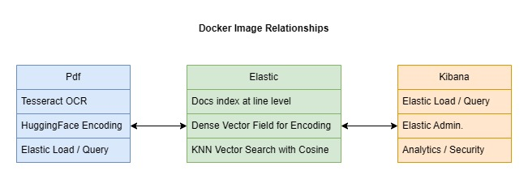

# PdfVectorStore

## Overview

This repository contains the code for an ETL pipeline which:
1. Extracts text data from .pdf files using Tesseract OCR
2. Encodes the extracted text using HuggingFace encoders
3. Loads the encoded text data into ElasticSearch
4. Searches ElasticSearch for text queries

## Dockerization

Elasticsearch and Kibana can be installed locally as separate docker images using the following guide.
* https://www.elastic.co/guide/en/elasticsearch/reference/current/docker.html

The relationships and functionality of each docker image is displayed in the flowchart below.

The Pdf docker image is generated from the code within this repository, and includes all the ETL, encoding and querying functionality with the Elastic image.

The Elastic image contains the elasticsearch installation, and stores the ETL'd .pdf line text data as documents. The elastic index stores the .pdf line text encodings as dense vector fields, and KNN Vector Search is utilised with Cosine Similarity when querying text in the elastic index.

The Kibana image contains the Kibana installation. Data can be loaded or queried through the Kibana image. The Kibana image also allow for further elastic admin, analytics or security operations.

### Execution Examples

    # create an elastic index called pdfvectorstore
    docker run --name pdf01 --net elastic --publish 8501:8501 --volume E:\GitHub\PdfVectorStore\.cred:/home/ubuntu/PdfVectorStore/.cred --rm oislen/pdfvectorstore:latest --operation create_index --elastic_index_name pdfvectorstore

    # etl a .pdf file into the elastic index pdfvectorstore
    docker run --name pdf01 --net elastic --publish 8501:8501 --volume E:\GitHub\PdfVectorStore\.cred:/home/ubuntu/PdfVectorStore/.cred --rm oislen/pdfvectorstore:latest --operation bulk_index --pdf_fpath E:\GitHub\PdfVectorStore\data\1.pdf --elastic_index_name pdfvectorstore
    
    # query the elastic index pdfvectorstore for the text Musterkunde
    docker run --name pdf01 --net elastic --publish 8501:8501 --volume E:\GitHub\PdfVectorStore\.cred:/home/ubuntu/PdfVectorStore/.cred --rm oislen/pdfvectorstore:latest  --operation query_index --elastic_index_name pdfvectorstore --text Musterkunde